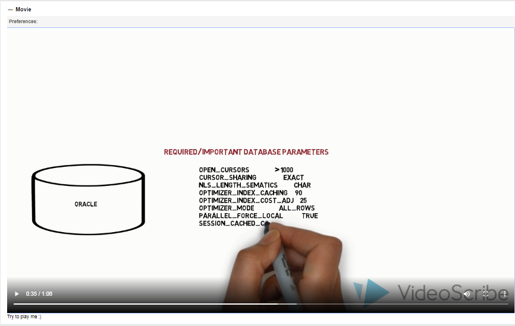
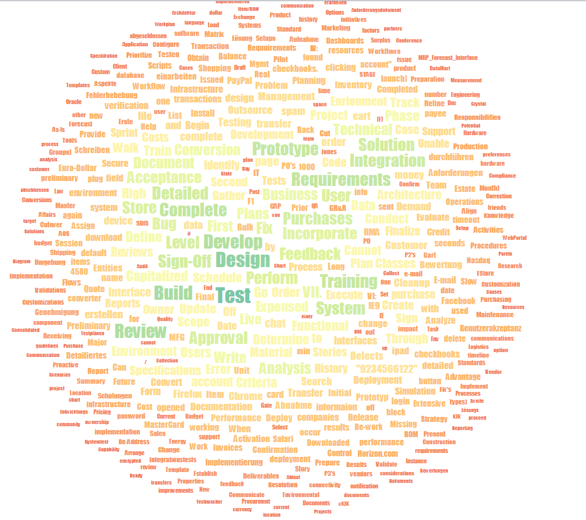
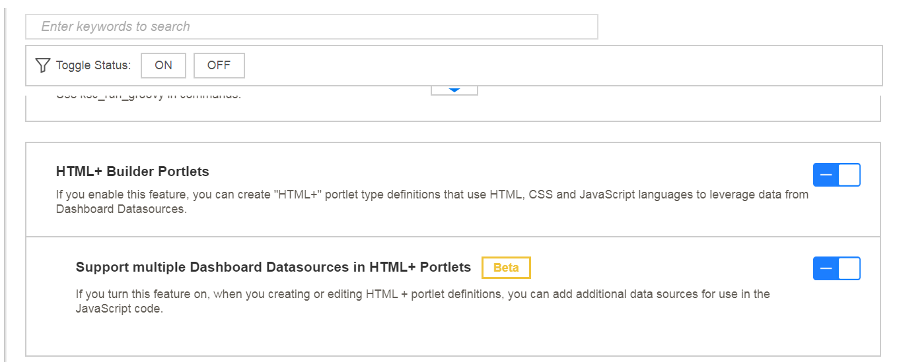

# ppm-html-plus-portlets
Public Github Repo hosting Micro Focus PPM Guide and Sample code for HTML+ portlets
Portlets for use with Microfocus PPM.  Most of the base code used to build these examples, can be found https://observablehq.com/@d3/gallery.

<a href="https://github.com/MicroFocus/ppm-html-plus-portlets/tree/master/src/collapsible%20tree">Collapsible Tree</a>

<a href="https://github.com/MicroFocus/ppm-html-plus-portlets/tree/master/src/radial%20tree">Radial Tree</a>

<a href="https://github.com/MicroFocus/ppm-html-plus-portlets/tree/master/src/zoomable%20sunburst">Zoomable Sunburst</a>

<a href="https://github.com/MicroFocus/ppm-html-plus-portlets/tree/master/src/video">Video</a>

<a href="https://github.com/MicroFocus/ppm-html-plus-portlets/tree/master/src/wordcloud">Word Cloud</a>

Questions contact:etienne.canaud@microfocus.com;christopher.hangl@microfocus.com

<b>Development mode vs. Production mode</b>
PPM starts by default in Production mode.  When the server is in PRODUCTION mode, HTML+ portlet definitions are in read-only, so you can only import portlet definitions using kMigratorImport.sh, not edit portlet definition.  If you develop HTML + Portlets you will need to do it in a development instance.  Please see the following instructions:

<a href="https://admhelp.microfocus.com/ppm/en/9.50-9.55/Help/Content/SA/InstallAdmin/enable-development-mode.htm?Highlight=Development mode">enable-development-mode</a>

or Windows: com.kintana.core.server.JVM_OPTIONS=-Dserver.mode=DEVELOPMENT

<b>Admin Console’s Feature Toggles for HTML+</b>

To use the HTML+ Portlets you must have the feature toggle on.  Moreover, to use multiple Dashboard Datasources in HTML+ Portlets you must have it on.
 
<b>Download D3js</b>
<a href="https://d3js.org/">d3js</a>
 Place on the server in for example 
/itg/web/knta/test/js/lib/d3.js

For d3.js, ythe version numbers are important. Current major version is v5 – but you can still find lots of example online that are built against earlier versions, such as v3. There are changes in APIs which means examples will likely need some changes before it works – so you should watch out for d3 version if you use some existing code.

<b>Example Visualizations</b>
We used many observable examples and converted them to function in PPM.  We cannot run Observable runtime, in PPM or utilize any of their worksheet implementations.
https://observablehq.com/@d3/gallery

<b>PPM Interactive REST API Help</b>
The below link shows the url to access the various API and results.
https://admhelp.microfocus.com/ppm/en/9.50-9.55/Help/Content/RG/WebSvcsREST/Interactive-API-Help.htm?Highlight=Rest

<b>How to attach to container and SVG</b>

code like the below : 
const svg = d3.create("svg") 
      .attr("viewBox", [0, 0, width, height]); 
	whould translate to : 
const svg = d3.select(container).append("svg") 
.attr("viewBox", [0, 0, width, height]); 	

Basically, we select the container and insert there.  This JavaScript code will be inserted as the body of a function that will receive the following parameters: container: The root 
 element of the portlet when the CSS, HTML and JavaScript code will be inserted

<b>How to access multiple Datasources</b>
Get data from default datasource but with different Filters: 
let customFilter = {"PROGRAM_NAME": [{"id":30120}]}; 
dataProvider.getData(customFilter, function(data) { 
  container.querySelector('#default-modified-filters-ds').textContent = data.data.length; 
  console.log('Default Datasource with modified filters:'); 
  console.log(DF.HtmlPlusUtils.utils.indexDataByColumnKey(data.data, data.columnsInfo)); 
}); 
	 
Note the new built-in method DF.HtmlPlusUtils.utils.indexDataByColumnKey(data, columnsInfo)which will turn the data from the “raw” datasource format (Array of Array of String or numbers) into a JSON structure where the column name is used as a key for each record. This makes it much simpler to manipulate data in JS code as you don’t have to access records columns by index, and don’t care the order of the columns in returned datasource. 
Get data from a different datasource, with no specific filter: 
dataProvider.getDatasourceData('SAMPLE_DATA_NUMERIC_DS', null, function(data) { 
  container.querySelector('#extra-ds-1').textContent = data.data.length; 
  console.log('SAMPLE_DATA_NUMERIC_DS:'); 
  console.log(DF.HtmlPlusUtils.utils.indexDataByColumnKey(data.data, data.columnsInfo)); 
}); 
Just pass the reference code of the datasource. The second parameter (null) is the filters, and null means “no filter”. Third parameter is call back method, because all calls that retrieve data from datasource are asynchronous. 
The return data contains the data in “raw” format in data.data, and the columns information in data.columnsInfo. 
For more example about how filters should be done, keep in mind that the filters of the current portlet preferences are passed to the JS code in the “filters” variable, so you just need to change portlet preferences to have some sample filters values.

