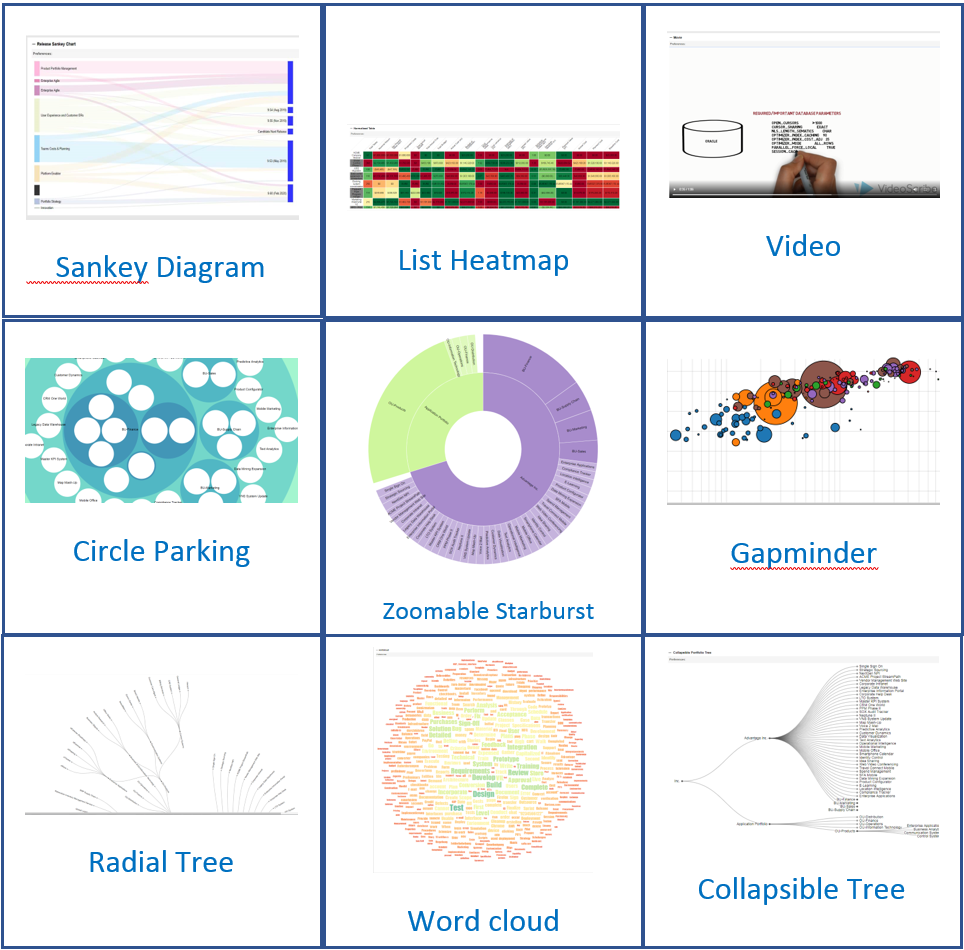

## Welcome to the PPM HTML+ Portlets GitHub Repository

If you want to learn how to create your own HTML+ portlets, check our [Tutorial](https://github.com/MicroFocus/ppm-html-plus-portlets/wiki/Tutorial)

You can look at what HTML+ portlets can do on the [Gallery](wiki/Gallery).

