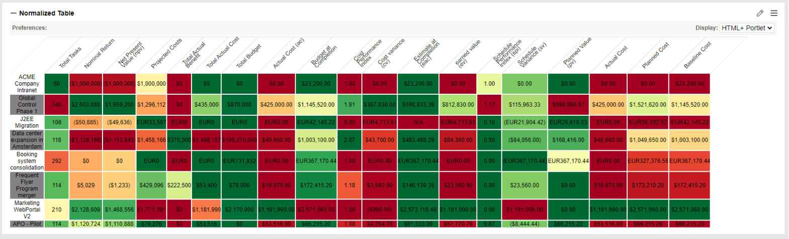

Basically, it is using a data source to list the active projects and get some aggregate information (total_tasks, more to add).
Calls 3 different web services  to obtain Project specific information(bac, cpi, ev, spi, npv, plannedcost, ect).   

•	/itg/rest2/projectFM/ 
•	/itg/rest2/projectEVM/ 
•	/itg/rest2/projectWP/category/  

Never added things like(would be a good one): 
•	/itg/rest2/planValue/{projectId} [private] Gets Statistics Plan Value by month for a project. 

Normalizes the data to between 0 and 1 simply by using

 Then present them using d3-scale-chromatic  (Which is easy changed)

 

