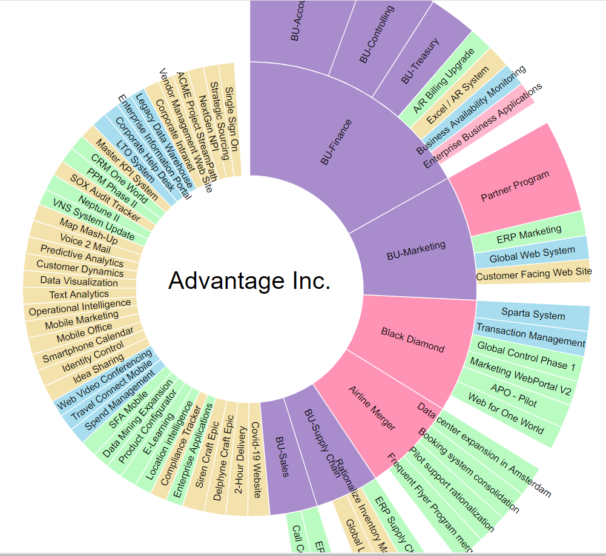

This example was adapted from Mike Bostock https://observablehq.com/@d3/zoomable-sunburst

This is a clickable visualization.

You can constrain the existing data source by coding in the PORTFOLIO_ID:

START WITH PORTFOLIO_ID in (30001, 32000)

